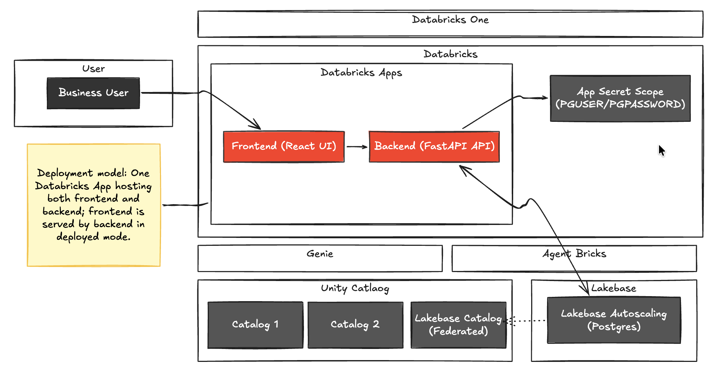

# JNJ Batch Automation Demo

This repo is a Databricks App + Lakebase demo for batch disposition workflows.
It supports:

- local development (`FastAPI` + `Vite`)
- Databricks App deployment via bundle (`databricks.yml`)
- native Postgres auth for Lakebase, with secrets managed in Databricks Secret Scopes

## Architecture

High-level deployment model shown in the diagram:

- One Databricks App hosts both the React frontend and FastAPI backend.
- The backend reads Lakebase native credentials (`PGUSER` / `PGPASSWORD`) from a Databricks Secret Scope.
- Lakebase Autoscaling (Postgres) is the primary transactional backend for batch disposition workflows.

## Solution Overview

- Frontend (`frontend/`) is a React app served locally by Vite in dev and by FastAPI in deployed mode.
- Backend (`app.py`, `server/`) is a FastAPI API (`/api/*`) with an `asyncpg` connection pool.
- DB auth behavior in `server/config.py`:
  - if `PGPASSWORD` is set, use native Postgres credentials (`PGUSER` + `PGPASSWORD`)
  - otherwise fallback to generated OAuth database credential flow
- Databricks deployment injects `PGUSER`/`PGPASSWORD` from secret scope resources configured in `databricks.yml`.

## Key Setup Scripts

`db_setup/` contains the scripts needed for the current approach:

- `seed_db.py`: create/seed `batch_release_db` and `batch_disposition`
- `create_native_app_role.py`: create/update native Postgres login role + grants
- `verify_native_role.py`: validate role/password DB connectivity
- `create_app_secrets.sh`: create secret scope + set `PGUSER` / `PGPASSWORD`
- `deploy_with_native_password.sh`: bundle deploy + app source deploy using secret-backed env vars

## Quick Local Run

1. Backend:
   - `python3 -m venv .venv`
   - `source .venv/bin/activate`
   - `pip install -r requirements.txt`
   - `python -m uvicorn app:app --host 0.0.0.0 --port 8000 --reload`
2. Frontend (new terminal):
   - `cd frontend`
   - `npm install`
   - `npm run dev`
3. Open `http://localhost:5173`

Use `.env` for local DB settings (never commit real secrets).

## Full Bootstrap Instructions

See `instructions.md` for the full from-scratch order for a new Databricks workspace.
